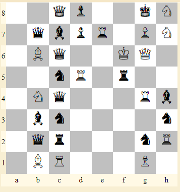

# Chessy

125 points - By Jeremy Lee

Tag: crypto

I've been learning a bit of chess recently. However, I can't seem to understand whatever this is. Can you help me?

## Hint
- What does FEN stand for?
- These positions don't seem like they'd actually be found in real games. Maybe there's something else to them?

## Write up

1. Create `chessies array`:

``` python3
chessies = []
with open('FEN.txt', 'r') as f:
    chessies = [l.strip() for l in f.readlines()]
```
2. FEN (Forsyth-Edwards Notation). Sample (https://www.dcode.fr/fen-chess-notation):

||      |
|-------|-------------------|
|K	    |White King	        |
|Q	    |White Queen        |
|R	    |White Rook	        |
|B	    |White Bishop	    |
|N	    |White Knight	    |
|P	    |White Pawn	        |
|       |                   | 
|k	    |Black King         |
|q	    |Black Queen        |
|p	    |Black Pawn         |
|r	    |Black Rook         |
|b	    |Black Bishop       |
|n	    |Black Knight       |
|1-8	|1 to 8 empty boxes |

With: `2qp2kN/1qbpR1PN/1Bq2KQ1/1knR1r2/1Nq3Rb/1bn4n/1qr3nR/1BR3P1` that will give out:




3. For each empty checker box it will be 0 and vice versa 1. Starting from row 1 to row 8. Sequentially with each `chessy` is different. Then put it back together.

``` python3
m = ''
for chessy in chessies:
    for row in reversed(chessy.split('/')):
        for c in row:
            m += '0' * int(c) if c.isdigit() else '1'
```

4. Convert binary string to string:

``` python3
print(int(m, 2).to_bytes((len(m) + 7) // 8, byteorder='big').decode())
```

Flag: `bcactf{3n_pa5sen7_ch3ckm4t3_92aj32lm9ui}`
