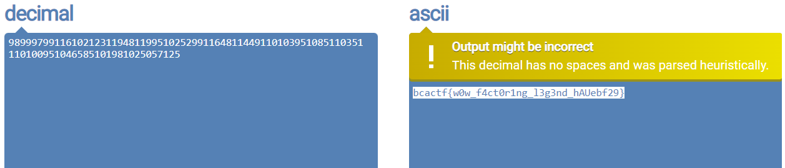

# Funky Factors

150 points - By Yusuf

Tag: crypto

Okay. Turns out the last algorithm wasn't secure after all... I think it was because I gave you too much information! Can you see if its really unbreakable this time?

[file.txt](file.txt)

## Hint
- Maybe there is something special about the size of the factors?

## Write up

1. Similar challenge 'Really Secure Algorithm' but no p and q and have n => [factordb](http://factordb.com/).
   
``` python3
from Crypto.Util.number import *

n=2451500972944572751067639135542724911455699735389455909239072706748572836232480252074031400797211301593443375562946962694274273077543664039604383719893091628336430360455909687693258270869995548362038438414271398400407702884883827901471304659858249570873108083356722001678236438255333957918061509916855914316124827985975637
e=65537
c=564821294757794643397264923024262896319938418162067361975239043464095797026401068770491393457675494733286339893448531140461611917094383999568438980881431718162518066997760793975381905628192846966986565357045880322008658585158406186349420366526027108151457442130148185466107727095596643126951328051023864119076639932491216

#find q and p by n <=> url: http://factordb.com/
p = 25854458289211
q = 94819274320962195588391046032702062340347787753861707917333803643013756112498232723436129143357983211782575094016538160601055922810359418391115604418400747711916131212069247930840360588635198701990348690076607422776450913659984003956055504691820691172367804759436721489067099363705442358971393631085988763567

phi = (q-1) * (p-1)


d = inverse(e, phi)

m = pow(c, d, n)

print(m)

#decode decimal to string url: https://onlineasciitools.com/convert-decimal-to-ascii
```



Flag: `bcactf{w0w_f4ct0r1ng_l3g3nd_hAUebf29}`