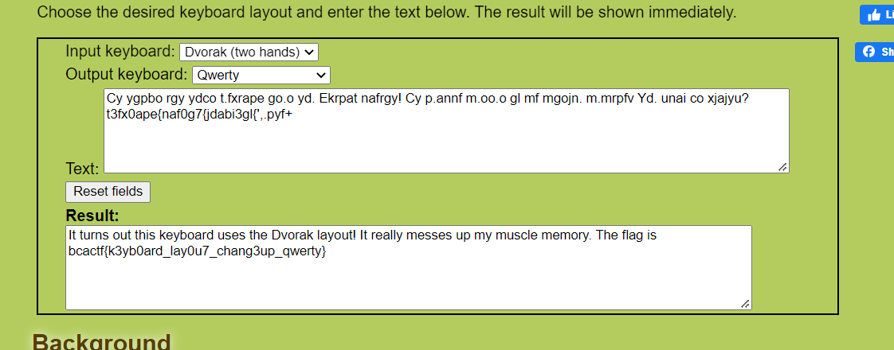

# New Keyboard
50 points - By Marvin

Tag: crypto

I bought a new keyboard, but it looks like it's typing gibberish!

[chall.txt](chall.txt)

## Hint
- My keyboard's not broken
- I just need to get used to it.
- It uses a different layout from most keyboards.
- Don't use dCode. dCode is broken.

## Write up

Convert QWERTY layout to DVORAK layout.

https://www.geocachingtoolbox.com/index.php?lang=en&page=dvorakKeyboard

Flag: `bcactf{k3yb0ard_lay0u7_chang3up_qwerty}`

