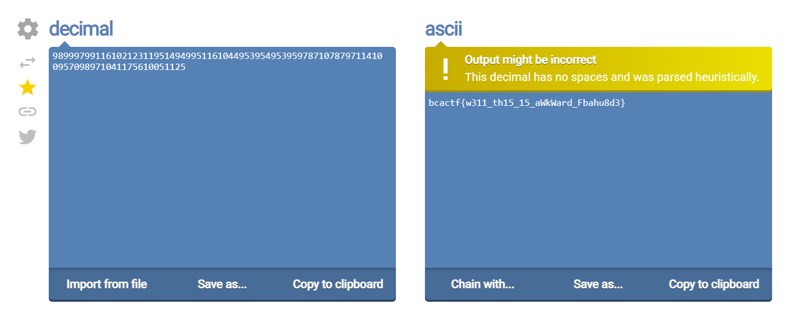

# Really Secure Algorithm

100 points - By Yusuf

Tag: crypto

As BCA students, we are always pushing the limits of existing technologies! Today, I had a breakthrough and created a Really Secure Algorithm. Can you see if it's secure or not?

## Hint
- Maybe the challenge name is a hint?
- I LOVE THE DECIMAL SYSTEM!!!!

## Write up

This is Really Secure Algorithm (`RSA`).

``` python3
from Crypto.Util.number import *

c=2464250865277757821428965675155522992457560926961269981007162702551724392855202737838222228070453790200941338664587735699257288834514629714756168098513102225910176071493495606754285130938545761358963130345627434505300662209712223707092556796463691345274980307752267846533429807624844732139940872159965514596

p=13088210551361451568469688622513897981426518145215665452575421200429661351366918393846354939929997184772996442562042682789520346956154452065929764946443447
q=1590315075423589460616307119751698143804899237034239149886381441961338087331451452499790183510691573469327467020483209974248378007574390792001615535983477
e=65537


phi = (q-1) * (p-1)
n = p*q

d = inverse(e, phi)
m_i = pow(c, d, n)

print(m_i)
```

Decode decimal to string - url: https://onlineasciitools.com/convert-decimal-to-ascii



Flag: `bcactf{w311_th15_15_aWkWard_Fbahu8d3}`
