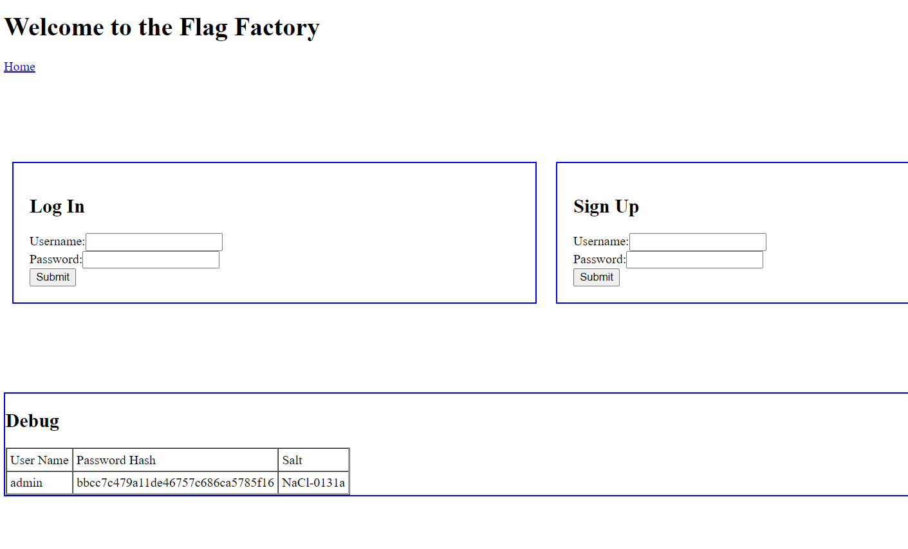
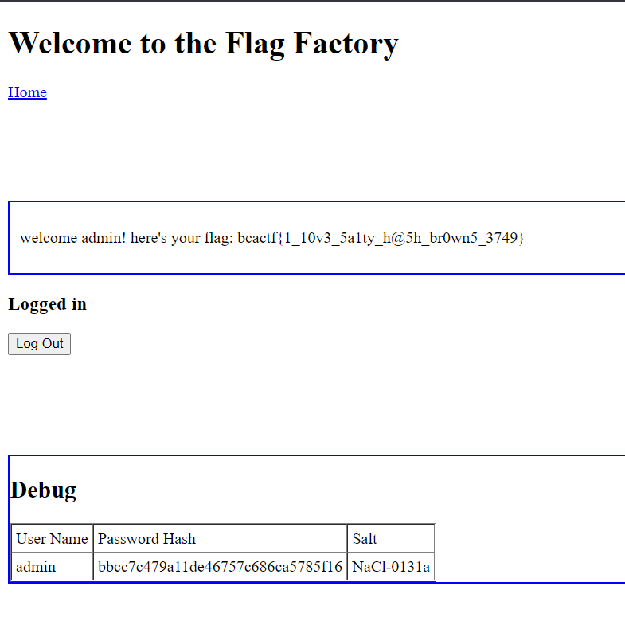

# Salty

150 points - By Zsofia Gordon

Tag: crypto

I found the flag factory!!! They keep their flags locked up. But I have insider info that they only use 4 digit alphanumeric passwords in lowercase. Can you get a flag?

[http://crypto.bcactf.com:49158/](http://crypto.bcactf.com:49158/)



## Hint
- Looks like a careless programmer left a debug table behind...
- Hmmm, that's not the password you put in...
- Don't bruteforce passwords on the website...

## Write up

1. From the description and hint we can guess that the password brute force has 4 characters including numbers and lowercase letters. By comparing the hash code with the given hash plus salt.

``` python3
import hashlib
import string
import itertools
import requests
ALPHA = string.digits + string.ascii_lowercase

salt = "NaCl-0b5f3"

passwd = ""
for k in itertools.product(ALPHA, repeat=4):
    key_string = ''.join(k)
    hash = hashlib.md5((key_string + salt).encode()).hexdigest()
    if hash == 'b978d6ab69cece4de10d3d2c64083a59':
        print("[+] username: admin/password: " + key_string)
        passwd = key_string
        break

```

2. Enter username (admin) and password (passwd). Get flag:

``` python3

headers = {
    'User-Agent': 'Mozilla/5.0 (Windows NT 10.0; Win64; x64) AppleWebKit/537.36 (KHTML, like Gecko) Chrome/99.0.4844.74 Safari/537.36',
    'Accept': 'text/html,application/xhtml+xml,application/xml;q=0.9,image/avif,image/webp,image/apng,*/*;q=0.8,application/signed-exchange;v=b3;q=0',
    'Cookie': 'PHPSESSID=0cd3cc5e64e90ed9f946ffefb7e5e550'
}

data = {
    'action':'login',
    'login_username': 'admin',
    'login_password': passwd
}
res = requests.post('http://crypto.bcactf.com:49158/home.php', data=data, headers=headers)
print(res.text.split("welcome admin! here's your flag: ")[-1].split('</p>')[0])
```



Flag: `bcactf{1_10v3_5a1ty_h@5h_br0wn5_3749}`