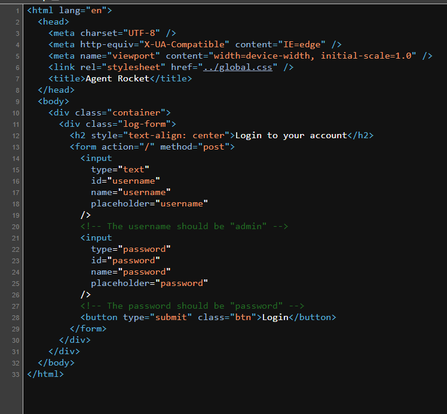
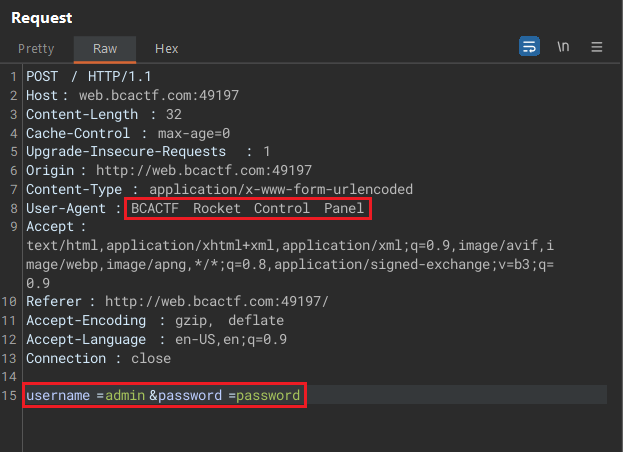
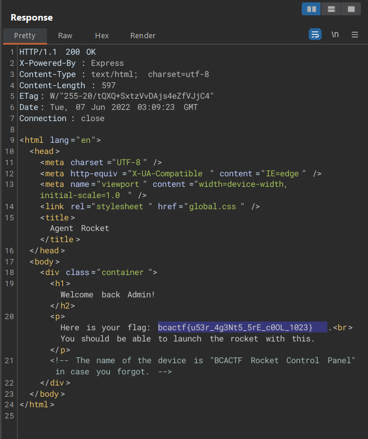

# Agent Rocket

75 points - By Shay Mor

Tag: webex

I need to launch the BCA CTF ROCKET to the moon! Unfortunately I lost my launch code (flag). You can find the launch code in the control panel.

[http://web.bcactf.com:49197/](http://web.bcactf.com:49197/)

# Hint
- Have you tried looking at the website more CLOSELY?
- You can't access the control panel from every device out there.

# Write up
1. Access [http://web.bcactf.com:49197/](http://web.bcactf.com:49197/) => Ctrl + U. Get username and password: admin/password

2. Using `Burp Suite`. Edit `Request` as shown below:

Flag: `bcactf{u53r_4g3Nt5_5rE_c0OL_1023}`