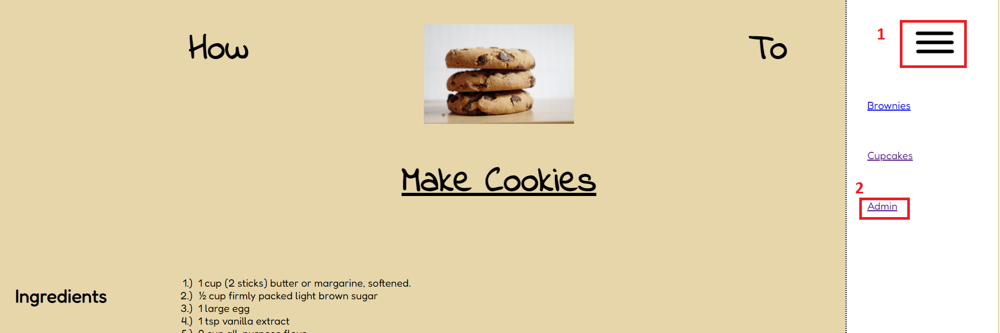
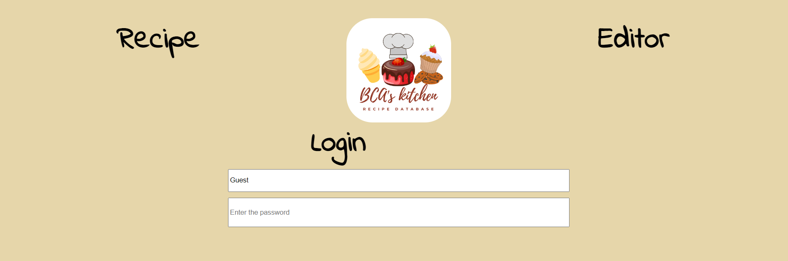
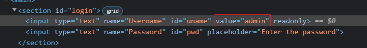
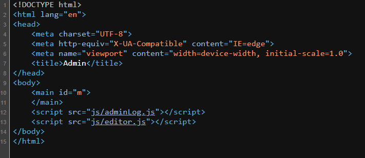
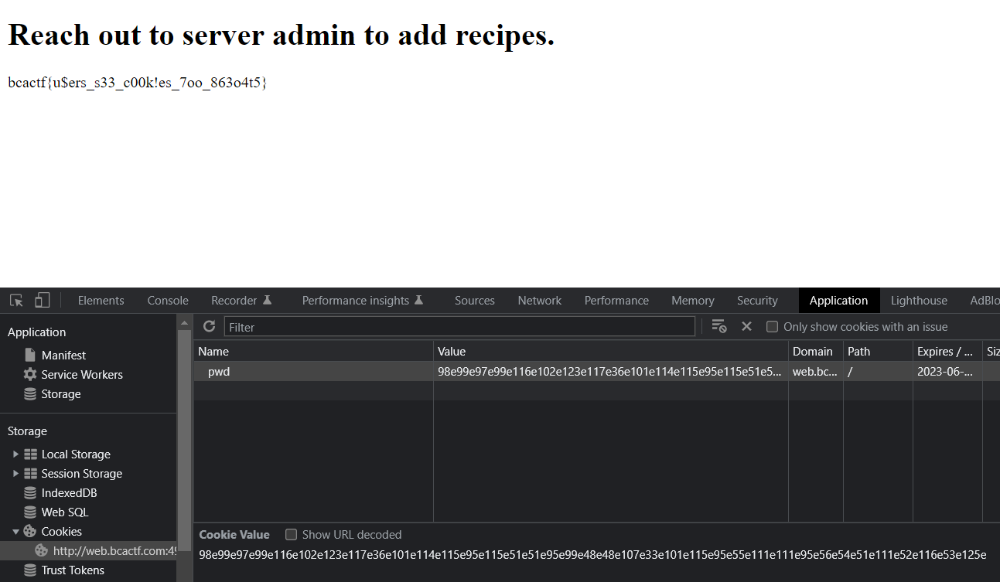

# Cookies

125 points - By Mudasir Ali

Tag: webex

Look, I made a website to teach you how to make cookies. There's some other recipes there too, and I made a super secure portal to add more.

[http://web.bcactf.com:49200/](http://web.bcactf.com:49200/)

# Hint
- Look through all the javascript files carefully
- Cookies can be modified client-side

# Write up
1. Access [http://web.bcactf.com:49197/](http://web.bcactf.com:49197/). Follow the steps as shown below:





2. F12 => edit HTML => Enter random password => Submit.



3. Ctrl + U. We get 2 URLs: 



- [/js/adminLog.js](http://web.bcactf.com:49200/js/adminLog.js) 

- [/js/editor.js"](http://web.bcactf.com:49200/js/editor.js) - Need attention:

``` js
if (getCookie("pwd") == "98e99e97e99e116e102e123e117e36e101e114e115e95e115e51e51e95e99e48e48e107e33e101e115e95e55e111e111e95e56e54e51e111e52e116e53e125e") {
    window.location.replace("flag.html");
}
```

1. Add cookies `(name: pwd/value: 98e99e97e99e116e102e123e117e36e101e114e115e95e115e51e51e95e99e48e48e107e33e101e115e95e55e111e111e95e56e54e51e111e52e116e53e125e)` => Reload page.



Flag: `bcactf{u$ers_s33_c00k!es_7oo_863o4t5}`