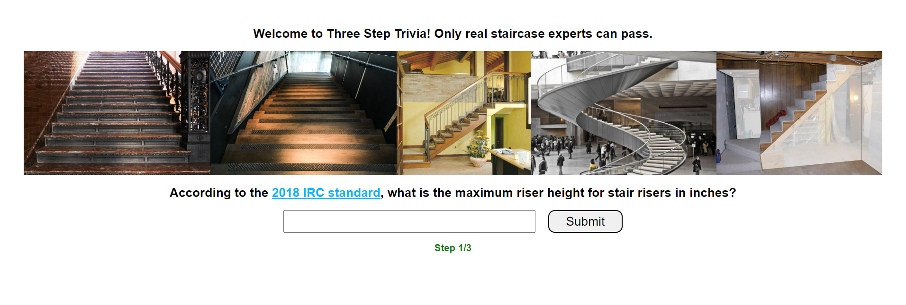
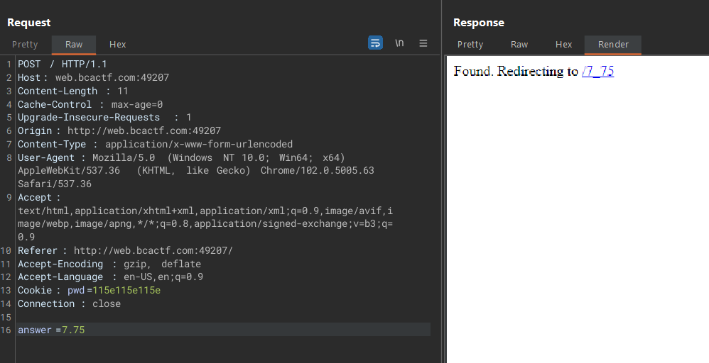
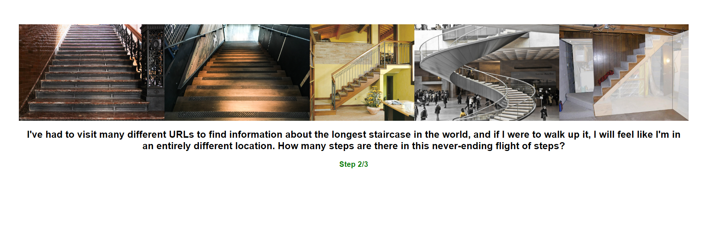
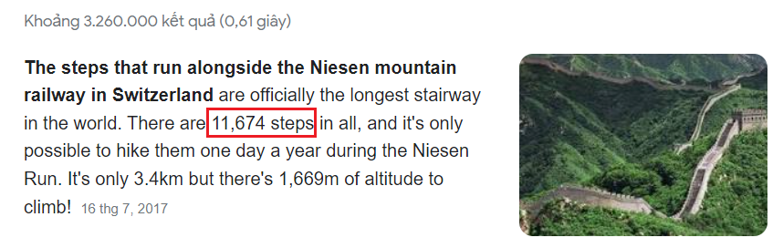
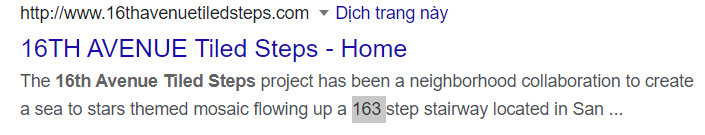
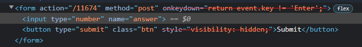
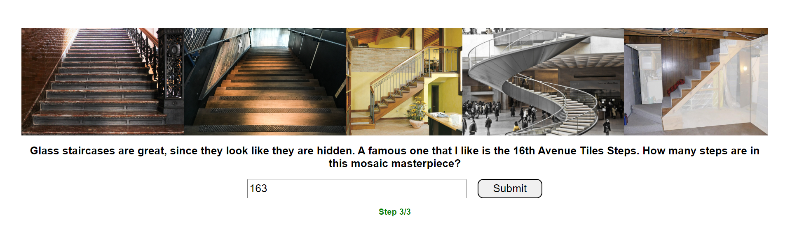
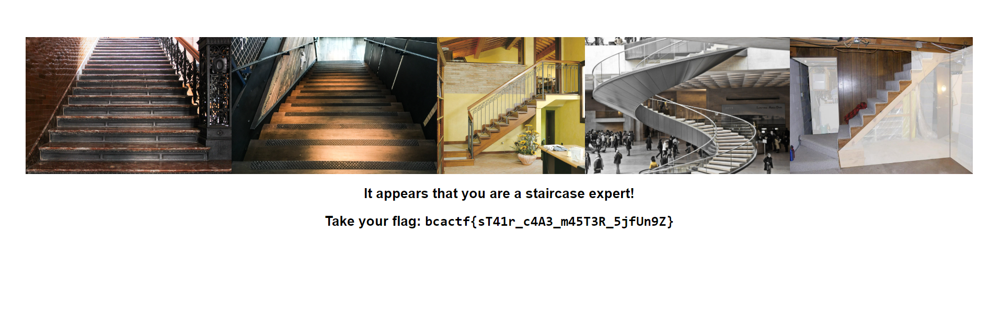

# Three Step Trivia

100 points - By Matthew, Krish

Tag: webex

Us at BCACTF love staircases so much that we decided to make a trivia quiz about them! Are you a staircase expert? Can you solve all three steps?

[http://web.bcactf.com:49207/](http://web.bcactf.com:49207/)

# Hint
- The internet is a helpful resource

# Write up

1. Search [google](https://www.google.com/) with keyword: `According to the 2018 IRC standard, what is the maximum riser height for stair risers in inches?`. We can find the result by converting to decimal and rounding to two decimal places.

2. Access [http://web.bcactf.com:49207/7_75](http://web.bcactf.com:49207/7_75). Search [google](https://www.google.com/) with keyword: `information about the longest staircase in the world`.

3. Access [http://web.bcactf.com:49207/11674](http://web.bcactf.com:49207/11674). Search [google](https://www.google.com/) with keyword: `16th Avenue Tiles Steps`. Then F12 => edit HTML => Enter `163` => Submit.

4. Get flag.

Flag: `bcactf{sT41r_c4A3_m45T3R_5jfUn9Z}`